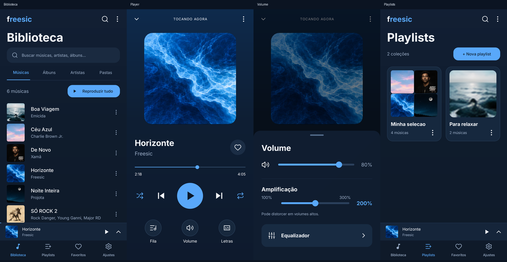

# Freesic

Player Android pessoal e offline. Identidade própria, interface em português, sem anúncios, contas, telemetria ou permissão de internet. Implementação nova orientada pela investigação técnica do Lark Player; nenhum DEX, `.so`, layout ou recurso proprietário do APK original foi incorporado.



**Android 8+ · Java 17 · Media3 · versão 1.2.0**

Para o primeiro commit e publicação, veja [Publicar no GitHub](docs/PUBLICAR.md).

## Interface 1.2

Interface reconstruída a partir da imagem escolhida: busca acima das abas, abas sublinhadas, mini player integrado, controles circulares, painel de volume e cartões de playlists. O mapa e as três rodadas de comparação estão em `design-qa.md`.

## Recursos

- Descoberta automática: solicita acesso a áudio na primeira abertura, consulta o MediaStore e observa novas mídias.
- Biblioteca local: músicas, álbuns, artistas, pastas, vídeos e histórico recente.
- Busca sem distinção de acentos; ordenação por título, artista, data ou duração.
- Abertura de arquivos pelo seletor Android e importação de vários arquivos.
- Reprodução de áudio/vídeo com Media3, fila editável, próxima/anterior, seek, aleatório, repetição e velocidade de 0,5× a 2×.
- Reprodução em segundo plano, sessão de mídia, notificação, controles Bluetooth e pausa ao desconectar fones.
- Playlists, favoritos, histórico e restauração de fila/posição, sem retomar áudio automaticamente ao abrir.
- Painel de volume do aparelho e amplificação de 100% a 300% com LoudnessEnhancer (até +9,54 dB de ganho de sinal).
- Seleção múltipla com busca dentro das playlists, usando a biblioteca do app.
- Equalizador com as bandas disponíveis no dispositivo; temporizador de pausa.
- Letras locais TXT/LRC; LRC sincronizado com múltiplos timestamps e offset.
- Capas incorporadas/arte de álbum nas listas, mini player, playlists, player e notificação, com cache assíncrono. Capa offline do lançamento de SÓ ROCK 2 e seleção manual de imagem para arquivos sem capa.
- Widget com controles; compartilhamento de arquivos mediante ação do usuário.
- Exportação e importação mesclada de playlists/favoritos em JSON.

## Instalação

Compile o APK seguindo as instruções abaixo ou utilize um APK assinado disponibilizado pelo responsável pelo projeto. Abra o arquivo em um Android 8.0/API 26 ou superior e autorize a instalação dessa origem quando o Android solicitar. Abra o Freesic e autorize o acesso a músicas e áudio. A biblioteca local indexada pelo Android é preenchida automaticamente. O seletor manual continua disponível em Ajustes para casos especiais. Para atualizar uma instalação existente e manter seus dados, use um APK assinado com a mesma chave, sem desinstalar a versão anterior.

Anúncios e rede não são apenas opções desligadas: não há SDKs de monetização e o manifesto mesclado remove `INTERNET`/`ACCESS_NETWORK_STATE`. A origem de reprodução também recusa esquemas remotos. O seletor de arquivos e o compartilhamento são componentes do Android; outros aplicativos escolhidos pelo usuário podem ter acesso à rede.

## Estrutura

- `MainActivity`: biblioteca, coleções, player e configuração.
- `PlaybackService`: dono do ExoPlayer, MediaSession, foco, efeitos, temporizador e snapshots.
- `Library`: consultas MediaStore e metadados de arquivos selecionados.
- `Store`: dados locais, playlists, favoritos e backup validado.
- `Track`: identidade por URI e conversão para MediaItem.
- `MusicLogic`: busca, relógio e parser de letras, com testes JVM.
- `BrandView`: logo vetorial original e leitura de capas fora da thread da interface.
- `FreesicWidget`: controles da sessão na tela inicial.

O projeto utiliza Java 17 para o código Android, views nativas e Media3 1.9.3. A decisão mantém o pacote pequeno e simplifica a compilação local. Não é uma tradução automática do código ofuscado original.

## Compilar

Requisitos: JDK 17 ou 21, SDK Android API 36, Android Build Tools, Gradle Wrapper incluído. Abra a pasta no Android Studio ou use `gradlew.bat` no Windows / `./gradlew` em Linux/macOS.

Configure `local.properties` com `sdk.dir` apontando para seu SDK, deixe o Android Studio criar o arquivo ou defina `ANDROID_HOME`. O SDK deve conter a plataforma Android 36 e os Build Tools 35.0.0 usados pelo AGP 8.13.2. O Gradle Wrapper 8.13 está incluído.

Um checkout novo **não precisa da chave privada** para compilar a versão de desenvolvimento:

```text
gradlew.bat assembleDebug testDebugUnitTest
```

Em Linux/macOS, use `./gradlew assembleDebug testDebugUnitTest`. Saída: `app/build/outputs/apk/debug/app-debug.apk`. Sem `signing.properties`, o Android usa a assinatura debug padrão.

Para gerar um release assinado, copie `signing.properties.example` para `signing.properties`, preencha os dados locais e disponibilize a chave indicada por `storeFile`. Para manter a identidade das versões já instaladas, restaure sua configuração e chave originais, em vez de criar outra chave.

```text
gradlew.bat assembleRelease lintRelease
```

Com assinatura configurada, a saída é `app/build/outputs/apk/release/app-release.apk`. Sem configuração privada, o Gradle produz `app-release-unsigned.apk`, que precisa ser assinado antes de instalar ou distribuir. Quando a configuração pessoal está presente, ela também é usada no debug, preservando o comportamento do ambiente original.

A primeira compilação baixa o Gradle e as dependências de Google Maven/Maven Central. Essa conexão acontece no computador de desenvolvimento, não no aplicativo. Chaves, senhas e caminhos do SDK são ignorados pelo Git; o modelo publicado contém apenas placeholders.

## Testes

`testDebugUnitTest` valida busca, esquemas locais, parser LRC, timestamps, offsets, seleção de linha, duração e conversão/limites do ganho. `lintRelease` verifica APIs e manifesto. Há testes instrumentados em `app/src/androidTest` que geram dois arquivos WAV e exercitam o serviço, playlists, backup e segundo plano. Esses fixtures não estão no APK de distribuição.

```text
gradlew.bat assembleDebug assembleDebugAndroidTest
adb install -r app/build/outputs/apk/debug/app-debug.apk
adb install -r app/build/outputs/apk/androidTest/debug/app-debug-androidTest.apk
adb shell am instrument -w com.freesic.app.test/com.freesic.app.FreesicInstrumentation
```

Execute os testes de dispositivo em um emulador ou perfil de teste: eles limpam as preferências do Freesic e criam músicas e coleções de demonstração nesse ambiente. Os testes adicionais de capas exigem os arquivos de teste locais descritos em `design-qa.md`; essas músicas não são distribuídas no repositório.

## Limites explícitos da versão 1.2

- Suporte de formatos e efeitos depende dos decodificadores e da implementação Android do aparelho; não foi incluído FFmpeg nativo.
- Não inclui download/busca online de letras, nuvem, streaming, conta ou sincronização.
- Não implementa editor de tags gravadas no arquivo, recorte/conversão de áudio, crossfade, sobreposição própria de tela bloqueada ou todos os comportamentos específicos do Lark Player.
- A busca de letras é por seleção local LRC/TXT; não há busca remota nem extração de todas as variantes de tags de letras.
- O temporizador funciona enquanto o processo de reprodução permanece ativo; não sobrevive a encerramento forçado do aplicativo.
- O backup JSON guarda referências locais, não copia as músicas. Transferir para outro aparelho pode exigir selecionar novamente arquivos e refazer referências.
- Android pode restringir reprodução em segundo plano por políticas de bateria do fabricante. Testes em emulador não substituem teste no celular pessoal.

## Origem das decisões

`research-inputs.json` registra hashes e identificação dos 14 artefatos fornecidos pelo usuário. O mapa de implementação está em `RESEARCH-MAPPING.md`. As evidências foram usadas como referência de comportamento; não são dependências do aplicativo final.

## Amplificação e privacidade

O percentual se refere à amplitude máxima do sinal, não a uma medição de volume acústico. O efeito Android comprime sinais que excedem sua faixa. Disponibilidade e resultado dependem da saída de áudio. Não há alteração do volume global sem ação do usuário.

A consulta usa MediaStore.Audio.Media.EXTERNAL_CONTENT_URI, coleção combinada que preserva os identificadores usados pelas playlists 1.0. Músicas em áreas privadas de outros apps, arquivos protegidos por .nomedia e mídias ainda não indexadas podem não aparecer automaticamente. Não é solicitada permissão irrestrita de arquivos.

## Créditos e documentação

- [Mapa de interface e verificação visual](design-qa.md)
- [Relação entre investigação e implementação](RESEARCH-MAPPING.md)
- [Créditos de imagens, fontes e ícones](THIRD_PARTY_NOTICES.md)
- [Avisos de dependências](THIRD_PARTY_NOTICES.txt)

As fontes, ícones, dependências e a capa musical mantêm seus créditos e condições próprios. Os avisos de terceiros não representam uma licença geral para todo o projeto.
