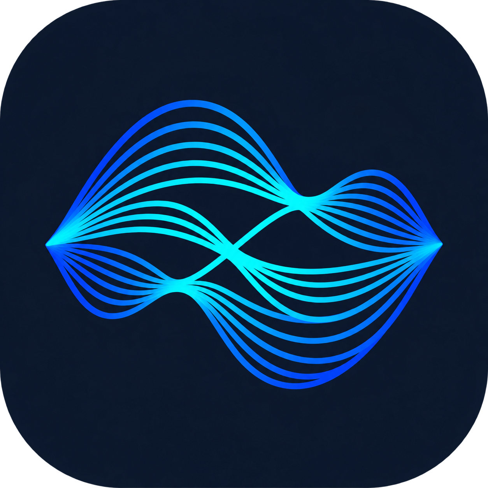

# Freesic

### Sua música. Seu espaço.

Um player Android para a sua coleção local, com interface azul, capas e controles sempre à mão.

**Android 8+ · Offline · Sem anúncios · Sem conta**

[**Baixar o APK**](https://github.com/dhiogoFrutuoso/Freesic/releases/latest) · [Novidades](https://github.com/dhiogoFrutuoso/Freesic/releases) · [Reportar um problema](https://github.com/dhiogoFrutuoso/Freesic/issues)

## Feito para ouvir

O Freesic encontra as músicas salvas no aparelho e reúne sua coleção em uma biblioteca simples de explorar. Organize playlists, acompanhe letras e continue ouvindo com a tela apagada.

| | O que você encontra |
| --- | --- |
| **Sua biblioteca** | Descoberta automática, busca e organização por músicas, álbuns, artistas e pastas. |
| **Do seu jeito** | Playlists com seleção múltipla, favoritos, histórico e capas dos arquivos. |
| **Reprodução completa** | Fila, aleatório, repetição, velocidade de 0,5× a 2× e controles na notificação, no Bluetooth e no widget. |
| **Controle de som** | Volume na tela, equalizador e amplificação de sinal de até 300%, conforme o suporte do aparelho. |
| **Para acompanhar** | Letras locais TXT/LRC, sincronização por tempo e temporizador para pausar. |
| **Sua coleção organizada** | Exportação e importação de playlists e favoritos em JSON. |

## Instale e dê o play

1. Abra a [release mais recente](https://github.com/dhiogoFrutuoso/Freesic/releases/latest) e baixe o arquivo `.apk`.
2. Instale em um aparelho com **Android 8.0 ou superior**, autorizando essa origem quando solicitado.
3. Abra o Freesic e permita o acesso a músicas e áudio. A biblioteca será preenchida com os arquivos indexados pelo Android.

Para atualizar, instale o novo APK por cima da versão anterior, com a mesma assinatura. Assim, suas playlists e preferências são mantidas. O arquivo `SHA256SUMS.txt` da release permite conferir a integridade do download.

## Música local, dados locais

O aplicativo não possui anúncios, telemetria, cadastro ou permissão de internet. A reprodução e a organização acontecem no aparelho; não há streaming, download de músicas ou sincronização em nuvem.

As músicas das capturas servem apenas para demonstração e não acompanham o APK. O backup guarda as referências dos arquivos, não os áudios. Ao escolher outro aplicativo para abrir ou compartilhar um arquivo, valem as permissões desse aplicativo.

## Dúvidas rápidas

**Uma música não apareceu?** Arquivos ainda não indexados, em pastas com `.nomedia` ou em áreas privadas de outros apps podem não aparecer. Use a abertura manual de arquivos em Ajustes quando necessário.

**A música está sem capa?** O Freesic usa imagens incorporadas e capas locais. Em **Opções da música → Escolher capa**, você pode associar uma imagem. Não há busca de capas pela internet.

**O que significa amplificação de 300%?** É o nome do preset máximo, que solicita 6.000 mB (+60 dB) ao efeito Android; não significa triplicar a potência acústica. O resultado depende da saída de áudio e pode distorcer em volumes altos.

## Para desenvolver

Aplicativo nativo em **Java 17**, com **AndroidX Media3**, Gradle Wrapper e SDK Android 36. Abra o projeto no Android Studio ou siga o [guia de desenvolvimento](docs/DESENVOLVIMENTO.md) para compilar, testar e assinar o APK.

| Documentação | Conteúdo |
| --- | --- |
| [Desenvolvimento](docs/DESENVOLVIMENTO.md) | Ambiente, comandos, assinatura, arquitetura e origem do projeto. |
| [Engenharia da versão 1.3](docs/ENGENHARIA-1.3.md) | Presets comprovados no Lark, cache de capas, gestos e limites da reconstrução. |
| [Correção da logo — 1.3.1](docs/validacao-1.3.1.json) | Renderização Android em diferentes tamanhos e integridade do APK. |
| [Validação da versão 1.3](docs/validacao-1.3.json) | Compilação, assinatura, testes e limites da cobertura. |
| [Validação histórica da versão 1.2](docs/VALIDACAO.md) | Resultados dos testes, capturas, revisões visuais e limitações conhecidas. |
| [Créditos e licenças](THIRD_PARTY_NOTICES.md) | Fontes, ícones, dependências e arte de terceiros. |

Encontrou um problema? [Abra uma issue](https://github.com/dhiogoFrutuoso/Freesic/issues) com a versão do Android, a versão do Freesic e os passos para reproduzir. Se for relevante, informe o formato do áudio; não é necessário enviar sua biblioteca pessoal.
